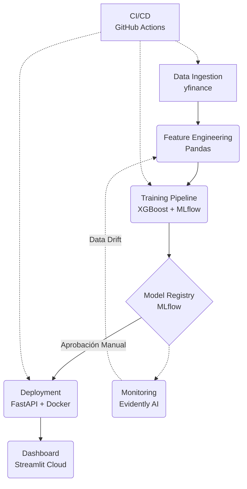

# 🚀 MLOps End-to-End: Predicción de Precios de NVIDIA con Despliegue en la Nube


[](https://github.com/FernandoHernandezEsquivel/MLOps_Nvidia_Project/actions/workflows/ci.yml)
[](https://github.com/FernandoHernandezEsquivel/MLOps_Nvidia_Project/actions/workflows/cd.yml)

> **Un sistema MLOps completo y desplegado para predecir el precio de la acción de NVIDIA (NVDA), construido siguiendo los principios de AWS MLOps con un stack 100% open-source. El proyecto incluye un pipeline de datos orquestado, un modelo en producción servido a través de una API REST, un dashboard interactivo para usuarios finales, y un sistema de monitoreo de deriva de datos.**

---

## 🌐 Links

| Componente | Enlace | Estado |
|------------|--------|--------|
| **📊 Dashboard Interactivo** | [Ver Demo](https://mlops-nvidia-project-06-2026.streamlit.app/) | 🟢 Activo |
| **🚀 API de Predicciones** | [Ver API](https://nvidia-price-api.onrender.com) | 🟢 Activa |
| **📚 Documentación API** | [Ver Docs](https://nvidia-price-api.onrender.com/docs) | 🟢 Activa |
| **📦 Repositorio** | [Ver Código](https://github.com/FernandoHernandezEsquivel/MLOps_Nvidia_Project) | 🟢 Activo |

> **Nota:** La API y el dashboard están desplegados en el plan gratuito de Render y Streamlit Cloud, respectivamente. La primera solicitud puede tardar hasta 50 segundos (cold start), pero las siguientes serán rápidas.

---

## 📝 Descripción del Proyecto

Este proyecto es una implementación práctica y completa de un sistema de **Machine Learning Operations (MLOps)**, basado en la metodología de AWS. El objetivo es predecir el precio de cierre de la acción de NVIDIA, pero el verdadero valor del proyecto reside en la arquitectura MLOps que lo rodea, demostrando cómo llevar un modelo de ML a producción de manera robusta, automatizada y monitoreada.

El sistema está construido íntegramente con herramientas **open-source**, garantizando su portabilidad y replicabilidad en cualquier entorno. El flujo completo abarca desde la ingesta de datos hasta la visualización de resultados en un dashboard público.

### 🎯 Objetivos del Proyecto

1.  **Diseñar e implementar un pipeline MLOps:** Automatizar la ingesta, procesamiento y entrenamiento de un modelo de Machine Learning.
2.  **Versionar y gobernar el modelo:** Utilizar MLflow para el seguimiento de experimentos y el registro de versiones de modelos.
3.  **Desplegar un modelo en producción:** Exponer el modelo a través de una API REST para realizar predicciones en tiempo real.
4.  **Crear un dashboard para usuarios finales:** Visualizar datos históricos y consumir la API para hacer predicciones interactivas.
5.  **Monitorear el modelo en producción:** Detectar la deriva de datos (data drift) para asegurar la calidad del modelo a lo largo del tiempo.
6.  **Establecer CI/CD:** Automatizar las pruebas y el despliegue del código y el modelo.

---

## 🏗️ Arquitectura MLOps

La arquitectura se divide en seis capas principales, siguiendo los principios de MLOps de AWS.

### 1. Data Pipeline (Orquestación)
- **Herramienta:** `Prefect`
- **Función:** Orquesta el flujo de trabajo, ejecutando las tareas de ingesta y procesamiento de datos de forma automatizada y reproducible.

### 2. Feature Engineering (Almacenamiento)
- **Herramienta:** `Pandas` + Archivos `Parquet`
- **Función:** Limpia los datos y crea nuevas características (features) como medias móviles, retornos y el RSI, almacenándolos en un formato eficiente para su uso posterior.

### 3. Training Pipeline (Experimentación)
- **Herramienta:** `MLflow`
- **Función:** Realiza el seguimiento de cada ejecución de entrenamiento, registrando parámetros, métricas y el propio modelo. El modelo es versionado en un **Model Registry**, permitiendo un control de versiones y un "gobierno" sobre qué versión pasa a producción.

### 4. Deployment Pipeline (Serving)
- **Herramienta:** `FastAPI`, `Docker`, `Render`
- **Función:** La versión aprobada del modelo se despliega como un microservicio dentro de un contenedor Docker. Este servicio se expone a través de una API REST, que es la que utiliza el dashboard para hacer predicciones.

### 5. Monitoring
- **Herramienta:** `Evidently AI`
- **Función:** Se ejecuta de forma programada para comparar los datos de entrenamiento con los datos de producción. Detecta la "deriva de datos" (Data Drift) y genera reportes, alertando sobre posibles degradaciones del rendimiento del modelo.

### 6. CI/CD (Integración y Despliegue Continuos)
- **Herramienta:** `GitHub Actions`
- **Función:** Automatiza las pruebas (CI) y el despliegue (CD) del código y el modelo. Cada push a las ramas `develop` o `main` activa el pipeline, asegurando que el código esté siempre en un estado desplegable.

---

## 📊 Flujo del Pipeline MLOps


## 🛠️ Stack Tecnológico

| Componente | Herramienta | Propósito |
|:---|:---|:---|
| **Orquestación** | Prefect | Orquestar el pipeline de datos. |
| **Almacenamiento** | Parquet | Almacenar datos de forma eficiente. |
| **Seguimiento** | MLflow | Rastrear experimentos y versionar modelos. |
| **Modelo** | XGBoost | Algoritmo de predicción. |
| **API** | FastAPI | Crear el servicio REST para las predicciones. |
| **Contenerización** | Docker | Empaquetar la API para un despliegue consistente. |
| **Dashboard** | Streamlit | Crear la interfaz de usuario interactiva. |
| **Monitoreo** | Evidently AI | Detectar deriva de datos. |
| **CI/CD** | GitHub Actions | Automatizar pruebas y despliegues. |
| **Nube** | Render, Streamlit Cloud | Desplegar y alojar la API y el dashboard. |

---

## 📂 Estructura del Proyecto
```markdown
MLOps_Nvidia_Project/
├── data/                              # Datos
│   ├── raw/                           # Datos crudos
│   └── processed/                     # Datos procesados
├── mlflow_runs/                       # Almacenamiento de MLflow
│   ├── models/                        # Modelos registrados
│   │   └── NVIDIA_Price_Predictor/    # Modelo específico
│   │       ├── meta.yaml              # Metadatos del modelo
│   │       ├── version-1/             # Versión 1 del modelo
│   │       ├── version-2/             # Versión 2 del modelo
│   │       ├── version-3/             # Versión 3 del modelo
│   │       └── version-4/             # Versión 4 del modelo (en producción)
│   └── (otros archivos de MLflow)     # Archivos internos de MLflow
├── src/                               # Código fuente principal
│   ├── data_ingestion.py              # Descarga de datos
│   ├── feature_engineering.py         # Creación de features
│   └── train_model.py                 # Entrenamiento y registro del modelo
├── pipelines/                         # Orquestación
│   └── data_pipeline.py               # Pipeline de Prefect
├── serving/                           # API
│   ├── app.py                         # Código de la API FastAPI
│   └── Dockerfile                     # Para construir la imagen Docker
├── frontend/                          # Dashboard
│   ├── app.py                         # Dashboard local
│   ├── streamlit_app.py               # Dashboard para Streamlit Cloud
│   └── requirements.txt               # Dependencias del dashboard
├── monitoring/                        # Monitoreo
│   ├── scheduled_monitor.py           # Script de monitoreo con Evidently AI
│   └── reports/                       # Reportes generados
├── tests/                             # Pruebas unitarias y de integración
│   ├── conftest.py                    # Configuración de pruebas
│   ├── test_data_ingestion.py         # Pruebas de ingesta
│   ├── test_feature_engineering.py    # Pruebas de features
│   ├── test_model.py                  # Pruebas del modelo
│   └── test_api.py                    # Pruebas de la API
├── scripts/                           # Scripts auxiliares
│   └── promote_model.py               # Para promocionar modelos en MLflow
├── .github/workflows/                 # CI/CD con GitHub Actions
│   ├── ci.yml                         # Integración Continua
│   └── cd.yml                         # Despliegue Continuo
├── .gitignore                         # Archivos ignorados por Git
├── LICENSE                            # Licencia MIT
├── requirements.txt                   # Dependencias del proyecto
├── docker-compose.yml                 # Para levantar servicios locales
├── render.yaml                        # Configuración para Render
└── README.md                          # Este archivo
```

---

## 🚀 Instalación y Ejecución Local

### Prerrequisitos
- Python 3.9+
- Git
- Docker

### Paso 1: Clonar el repositorio
```bash
git clone https://github.com/FernandoHernandezEsquivel/MLOps_Nvidia_Project.git
cd MLOps_Nvidia_Project
```
### Paso 2: Crear y activar un entorno virtual
```bash
python -m venv venv
source venv/bin/activate  # En Windows: venv\Scripts\activate
```
### Paso 3: Instalar las dependencias
```bash
pip install -r requirements.txt
```
### Paso 4: Ejecutar el pipeline de datos y entrenamiento
```bash
python src/data_ingestion.py
python src/feature_engineering.py
python src/train_model.py
```
### Paso 5: Iniciar la API y el Dashboard (en terminales separadas)
```bash
# Terminal 1: API
cd serving
python app.py
```
```bash
# Terminal 2: Dashboard
cd frontend
streamlit run app.py
```
### Paso 6: Acceder a los servicios

📊 Dashboard: http://localhost:8501

📚 Documentación API: http://localhost:8000/docs

🔬 MLflow UI: http://localhost:5000 (si lo inicias)

### 🔄 CI/CD con GitHub Actions

## Integración Continua (CI)

El archivo `.github/workflows/ci.yml` se activa en cada push o pull request a las ramas `main` o `develop`. Sus pasos son:

1.  Instalar las dependencias.
2.  Ejecutar todas las pruebas con `pytest`.
3.  Verificar la calidad del código con `flake8`.

**Estado actual:**
[](https://github.com/FernandoHernandezEsquivel/MLOps_Nvidia_Project/actions/workflows/ci.yml)

## Despliegue Continuo (CD)

El archivo `.github/workflows/cd.yml` se activa al hacer push a la rama `main`. Sus pasos son:

1.  Ejecutar el pipeline de datos completo (ingesta, procesamiento y entrenamiento).
2.  Subir los artefactos (modelo y datos procesados) como artefactos de la acción.

**Estado actual:**
[](https://github.com/FernandoHernandezEsquivel/MLOps_Nvidia_Project/actions/workflows/cd.yml)

---

### 📊 Resultados del Modelo

| Métrica | Valor |
|:---|:---|
| **RMSE** | 0.17296 |
| **R²** | 0.82 |

---

### 🔍 Monitoreo del Modelo en Producción

El sistema utiliza **Evidently AI** para monitorear la deriva de datos (Data Drift). El script `monitoring/scheduled_monitor.py` se ejecuta periódicamente (o se puede ejecutar manualmente) para:

1.  **Cargar los datos de referencia** (los datos con los que se entrenó el modelo).
2.  **Cargar los datos actuales** (los datos más recientes de producción).
3.  **Generar un reporte** que compara las distribuciones de las características.
4.  **Detectar deriva** y guardar un resumen de las métricas.

**Cómo ejecutar el monitoreo:**

```bash
python monitoring/scheduled_monitor.py
```
**Reportes generados:**
- `monitoring/reports/evidently_report_*.html`: Reporte visual interactivo.
- `monitoring/reports/metrics_*.json`: Métricas de deriva en formato JSON.

---

### 🚧 Próximos Pasos y Mejoras Futuras

- [ ] **Alertas Automáticas:** Configurar notificaciones por Slack/email cuando se detecte deriva de datos.
- [ ] **Feature Store:** Implementar **Feast** para una gestión más robusta de las características.
- [ ] **A/B Testing:** Desplegar dos versiones del modelo en paralelo para comparar su rendimiento.
- [ ] **Escalabilidad:** Orquestar el pipeline con **Apache Airflow** o **Kubeflow** para un manejo más complejo.
- [ ] **Explicabilidad (XAI):** Implementar **SHAP** para explicar las predicciones del modelo.

---

### 🤝 Contribuciones

Las contribuciones son bienvenidas. Si deseas mejorar el proyecto, por favor:

1.  Haz un fork del repositorio.
2.  Crea una rama para tu feature (`git checkout -b feature/NuevaFeature`).
3.  Realiza tus cambios y haz commit (`git commit -m 'Añadir NuevaFeature'`).
4.  Sube tus cambios (`git push origin feature/NuevaFeature`).
5.  Abre un Pull Request.

---

### 📄 Licencia

Distribuido bajo la Licencia MIT. Ver `LICENSE` para más información.

---

### ✨ Agradecimientos

- **AWS:** Por proporcionar la metodología MLOps que inspiró este proyecto.
- **Comunidad Open Source:** Por todas las herramientas que hicieron esto posible.
- **Yahoo Finance:** Por proporcionar los datos financieros.

---

### 📬 Contacto

**Fernando Hernández Esquivel**

[](https://linkedin.com/in/feheesmat-mus-2000)
[](https://github.com/FernandoHernandezEsquivel)
[](mailto:fehees@hotmail.com)

---
